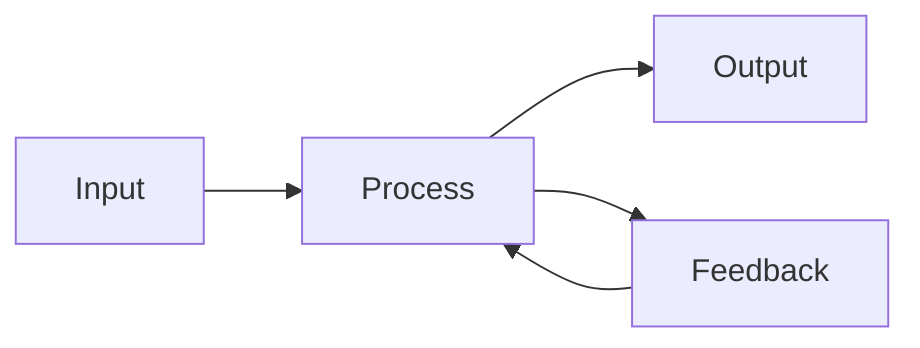

# Documentation

This directory contains additional documentation for the Electroplate-Store-v1 project.

## Purpose

Project-specific documentation including:
- Architecture and design documents
- API documentation
- User guides and tutorials
- Technical specifications
- Development guidelines

## Organization

```
docs/
├── architecture/       # System architecture documents
├── api/               # API documentation
├── guides/            # User guides and tutorials
├── specifications/    # Technical specifications
└── development/       # Development guidelines
```

## Document Types

### Architecture Documentation
- System overview and high-level design
- Component interactions and data flow
- Design decisions and rationale
- Block diagrams and schematics

### API Documentation
- Component interfaces
- Function and method documentation
- Signal definitions
- Usage examples

### User Guides
- Getting started guide
- Component usage tutorials
- Best practices
- Troubleshooting

### Technical Specifications
- Requirements documents
- Protocol specifications
- Hardware specifications
- Performance requirements

### Development Guidelines
- Coding standards
- Testing guidelines
- Review process
- Contribution guidelines

## Documentation Standards

### File Naming
- Use descriptive, lowercase names with hyphens
- Examples: `system-architecture.md`, `api-reference.md`

### Format
- Use Markdown for most documentation
- Include diagrams where helpful
- Keep sections focused and concise
- Use consistent heading levels

### Content Guidelines

1. **Clear and Concise**: Write for your audience
2. **Examples**: Include code examples when relevant
3. **Up-to-Date**: Keep documentation current with code
4. **Cross-Reference**: Link to related documents
5. **Version**: Document which version information applies to

### Document Template

```markdown
# Document Title

**Version**: 1.0
**Last Updated**: YYYY-MM-DD
**Author**: Name

## Overview

Brief overview of the document purpose and scope.

## Background

Context and background information.

## Details

Main content of the document.

### Subsection 1

Content...

### Subsection 2

Content...

## Examples

Practical examples if applicable.

## References

- Related Document 1
- Related Document 2
- External Reference

## Revision History

| Version | Date | Author | Changes |
|---------|------|--------|---------|
| 1.0 | YYYY-MM-DD | Name | Initial version |
```

## Key Documents

### Required Documentation

1. **Architecture Overview** (`architecture/system-overview.md`)
   - System architecture
   - Major components
   - Design patterns

2. **API Reference** (`api/component-reference.md`)
   - All public interfaces
   - Signal definitions
   - Usage examples

3. **Getting Started** (`guides/getting-started.md`)
   - Setup instructions
   - First project tutorial
   - Common workflows

4. **Coding Standards** (`development/coding-standards.md`)
   - Style guidelines
   - Best practices
   - Code organization

### Recommended Documentation

1. **Design Rationale** (`architecture/design-decisions.md`)
   - Why certain approaches were chosen
   - Trade-offs considered
   - Alternative approaches

2. **Testing Guide** (`development/testing-guide.md`)
   - Testing strategy
   - How to write tests
   - Test coverage requirements

3. **Troubleshooting** (`guides/troubleshooting.md`)
   - Common issues
   - Solutions
   - Debugging tips

## Generating Documentation

### From Code

Use docstrings to document code, then generate docs:

```python
def example_function(param1, param2):
    """
    Brief description.
    
    Detailed description of what the function does.
    
    Parameters
    ----------
    param1 : type
        Description of param1
    param2 : type
        Description of param2
    
    Returns
    -------
    return_type
        Description of return value
    
    Examples
    --------
    >>> example_function(1, 2)
    3
    """
    pass
```

### Building Documentation

```bash
# Generate API docs from source
python scripts/generate_docs.py

# Build Sphinx documentation (if configured)
cd docs/
make html
```

## Diagrams and Visuals

Include diagrams to clarify complex concepts:

### Block Diagrams
Use tools like:
- draw.io
- PlantUML
- Mermaid

Example Mermaid diagram:


### Waveform Diagrams
For timing diagrams, use:
- WaveDrom
- GTKWave screenshots
- Timing diagram tools

### State Diagrams
For state machines:
- PlantUML state diagrams
- Graphviz
- State machine visualization tools

## Documentation Maintenance

### Regular Updates
- Review quarterly
- Update after major changes
- Keep version history
- Mark deprecated features

### Review Process
1. Documentation reviewed with code
2. Technical accuracy verified
3. Clarity and completeness checked
4. Links and references validated

## Style Guide

### Writing Style
- Use active voice
- Be concise and direct
- Define acronyms on first use
- Use consistent terminology

### Code Examples
- Tested and working
- Properly formatted
- Well-commented
- Realistic use cases

### Formatting
- Use proper Markdown syntax
- Include table of contents for long documents
- Use code blocks with language identifiers
- Break up long sections with headings

## Resources

### Documentation Tools
- [Markdown Guide](https://www.markdownguide.org/)
- [Sphinx Documentation](https://www.sphinx-doc.org/)
- [PlantUML](https://plantuml.com/)
- [Mermaid](https://mermaid-js.github.io/)

### Writing Resources
- [Google Developer Documentation Style Guide](https://developers.google.com/style)
- [Write the Docs](https://www.writethedocs.org/)

### MyHDL Documentation
- [MyHDL Manual](http://docs.myhdl.org/en/stable/manual/)
- See `/doc/` in root directory for core documentation

## Contributing

To contribute documentation:

1. Follow the templates and style guide
2. Test any code examples
3. Check links and references
4. Update the revision history
5. Submit for review

Well-written documentation is as important as well-written code!
